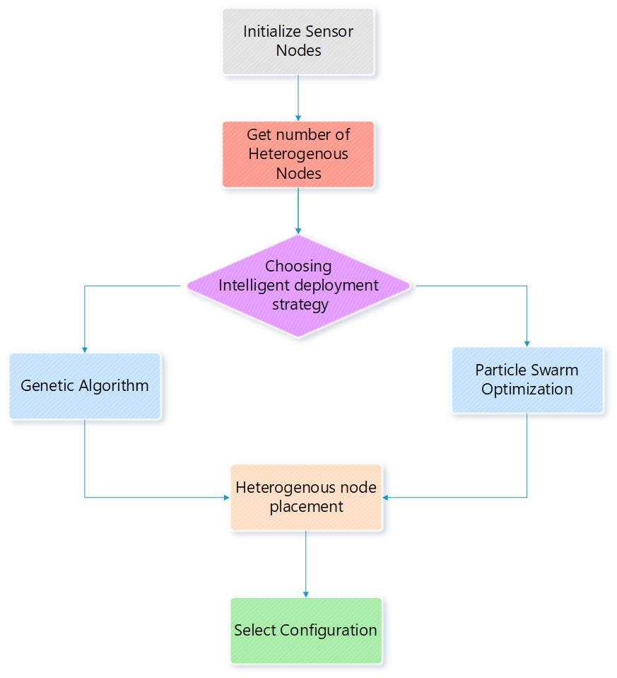
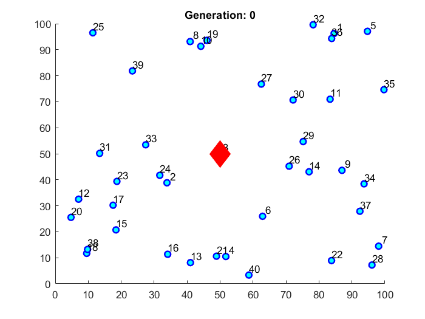
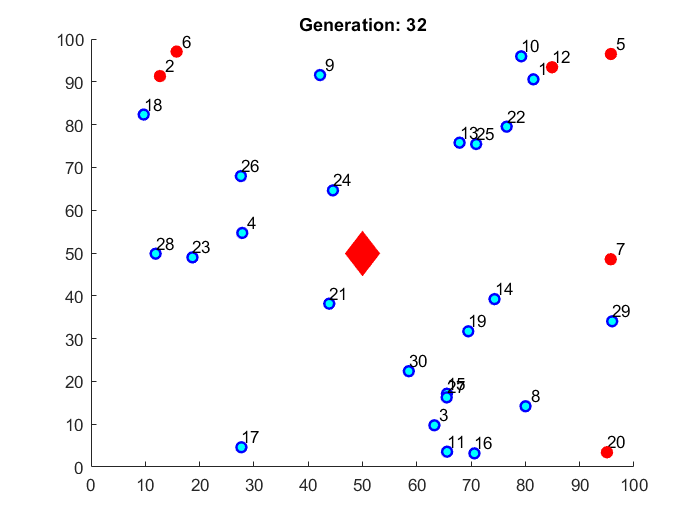
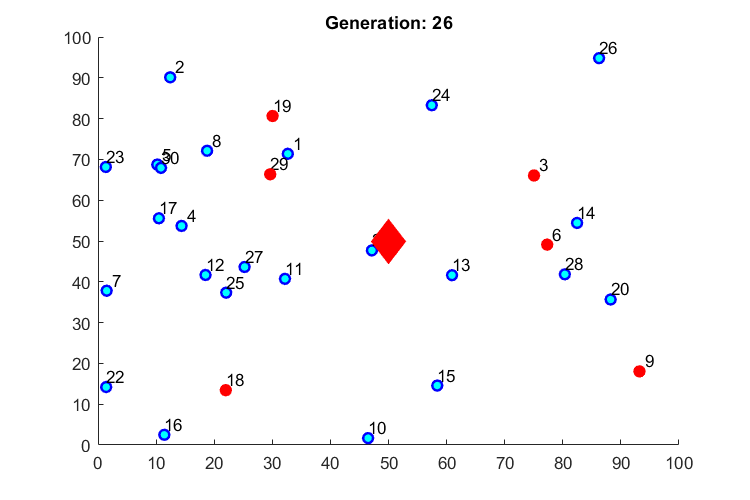
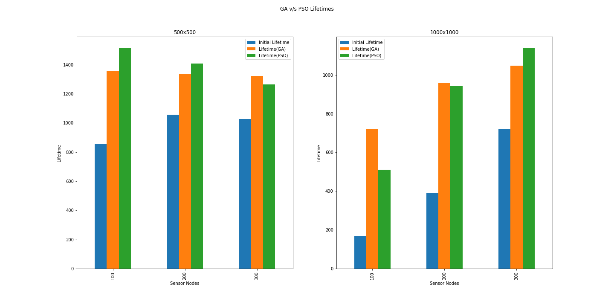
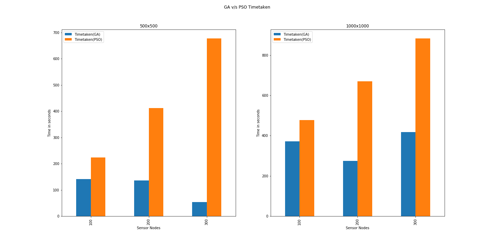
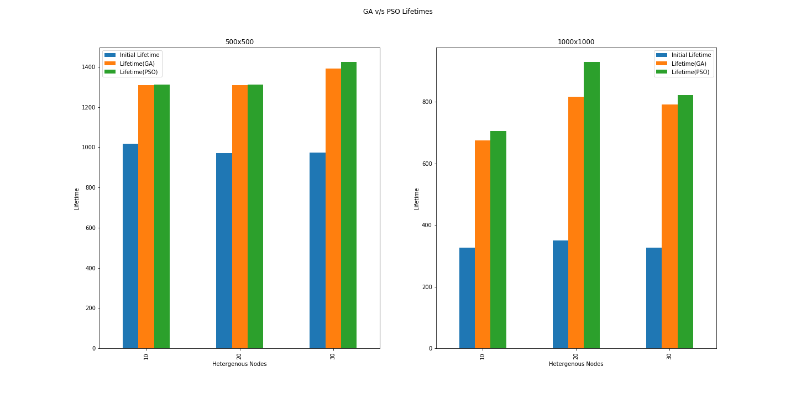
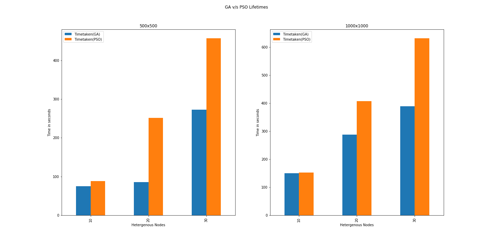
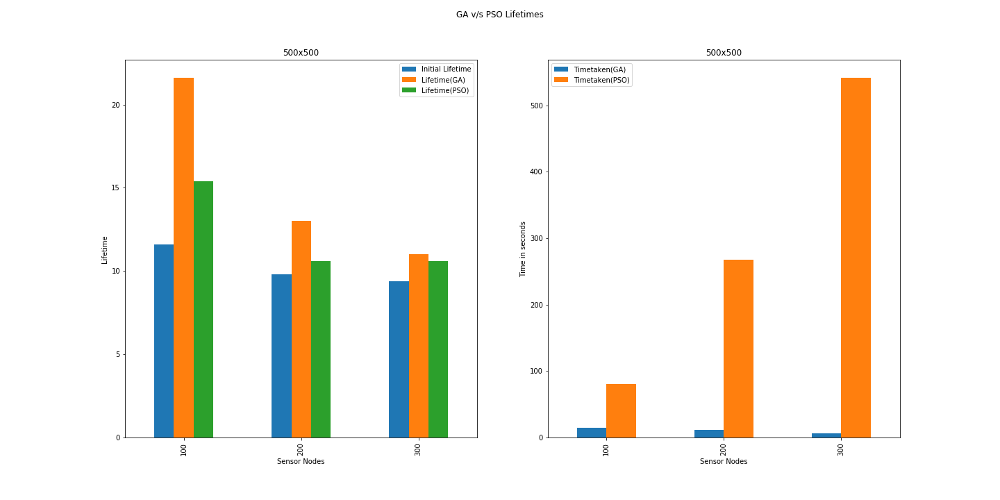

# Intelligent deployment strategy for heterogeneous nodes to increase the network lifetime of wireless sensor networks

## Methodology
</img>

## Random deployment(Sample)


## Results after using intelligent algorithms
- Direct Transmission

- Multihop transmission


## Comparison (GA v/s PSO)

### Varying Sensor Nodes for Multihop transmission

```
Terrain Size                     : 500x500, 1000x1000
Initial Sensor node energy       : 0.5
Initial Heterogeneous node energy: 1.5
Trials per configuration         : 5
# Sensor Nodes                   : 100-300
# Heterogeneous Nodes            : 30
```

#### Lifetime Comparison

####  Time to solution Comparison


```
Terrain Size                     : 500x500, 1000x1000
Initial Sensor node energy       : 0.5
Initial Heterogeneous node energy: 1.5
Trials per configuration         : 5
# Sensor Nodes                   : 150
# Heterogeneous Nodes            : 10-30
```

### Varying Heterogeneous Nodes for Multihop transmission
#### Lifetime Comparison

####  Time to solution Comparison


```
Terrain Size                     : 500x500, 1000x1000
Initial Sensor node energy       : 5.0
Initial Heterogeneous node energy: 1.5
Trials per configuration         : 5
# Sensor Nodes                   : 100-300
# Heterogeneous Nodes            : 30
```

### Varying Sensor Nodes for Direct transmission


## Team members / Collaborators
- [Amal](https://github.com/amalshaji)
- [Devi](https://github.com/Devi-DivyaSri)
- [Naveen](https://github.com/naveenb11)
- [Jeevan](https://github.com/G1Sai)